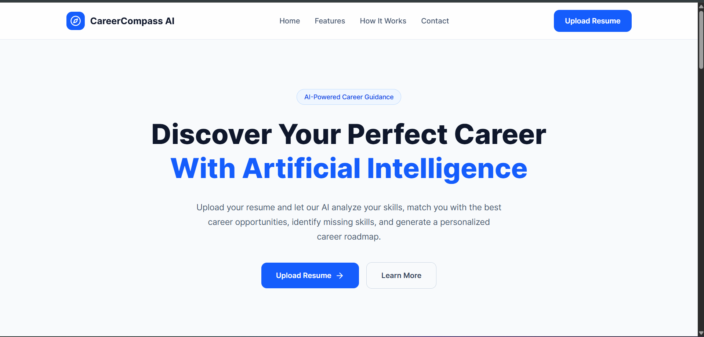
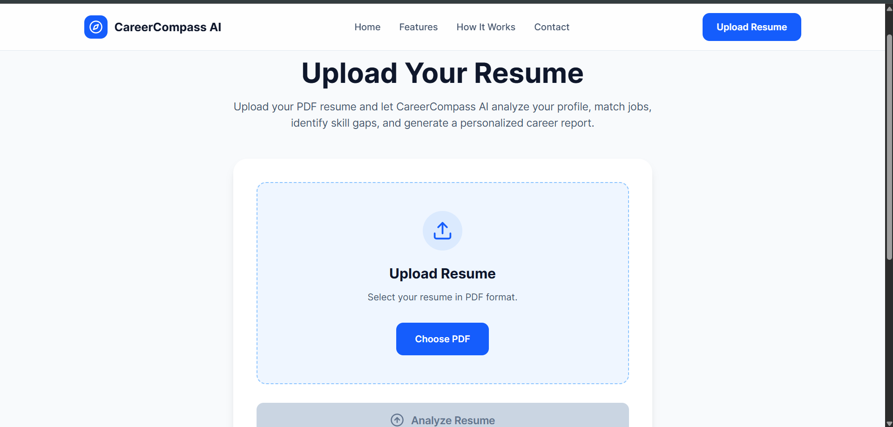
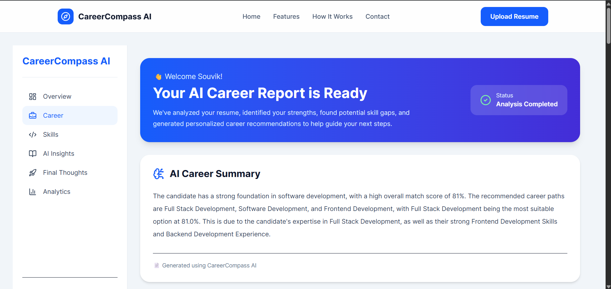
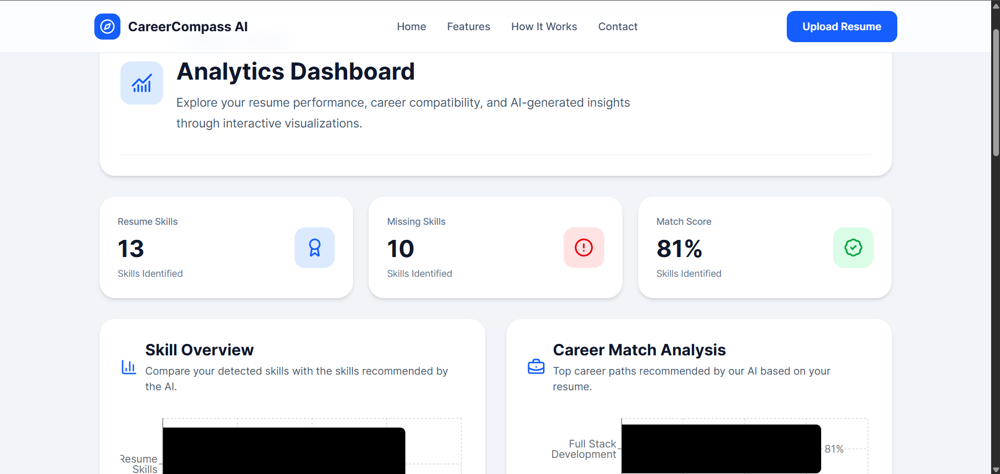
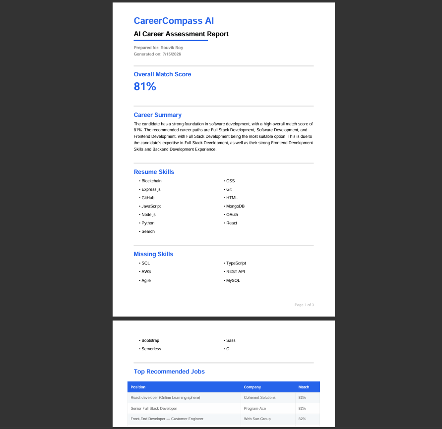
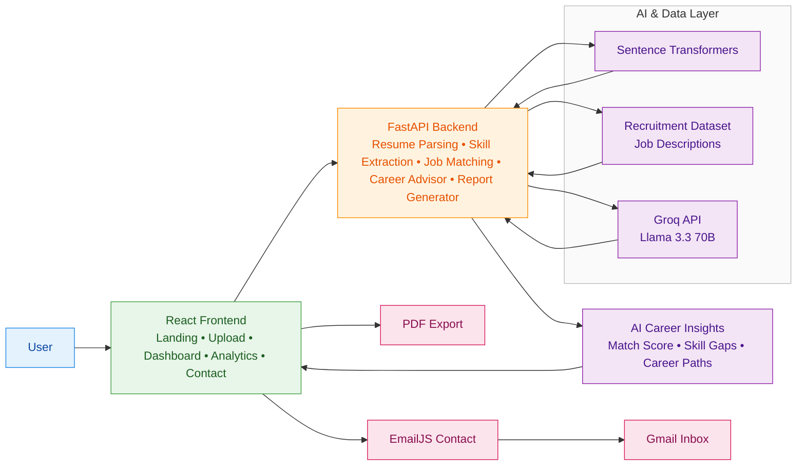

# 🚀 CareerCompass AI

### AI-Powered Resume Analyzer & Career Recommendation Platform

CareerCompass AI is an intelligent career guidance platform that analyzes resumes, matches candidates with relevant job opportunities using semantic similarity, identifies skill gaps, generates personalized AI career reports, visualizes insights through interactive dashboards, and exports professional PDF reports.

---

<p align="center">

AI Resume Analysis • Semantic Job Matching • Skill Gap Detection • Groq-Powered Career Reports • Analytics Dashboard • PDF Export

</p>

<p align="center">


</p>

## 📑 Table of Contents

- [Overview](#-overview)
- [Features](#-features)
- [Screenshots](#-screenshots)
- [AI Pipeline](#-ai-pipeline)
- [Tech Stack](#-tech-stack)
- [Architecture](#-architecture)
- [Installation](#-installation)
- [Environment Variables](#-environment-variables)
- [API Endpoints](#-api-endpoints)
- [Future Improvements](#-future-improvements)
- [Author](#-author)

## 📖 Overview

Recruiters and hiring managers often spend only a few seconds reviewing a resume before making an initial decision. Traditional resume screening is time-consuming, subjective, and frequently overlooks candidates whose skills align well with a role but are described using different terminology.

**CareerCompass AI** addresses this challenge by combining Natural Language Processing (NLP), semantic similarity search, and Large Language Models (LLMs) to deliver intelligent career recommendations from a candidate's resume.

Instead of relying on simple keyword matching, the platform understands the semantic meaning of resumes and job descriptions using **Sentence Transformers**, enabling more accurate job matching. It identifies missing skills, evaluates overall career readiness, recommends suitable career paths, and generates personalized AI-powered career guidance through the **Groq LLM API**.

The platform also provides an interactive analytics dashboard, exports professional PDF career reports, and includes a fully functional contact system powered by **EmailJS**, making it a complete end-to-end career guidance solution.

---

### 🎯 Project Objectives

- Automate resume analysis using NLP techniques.
- Match candidates with relevant job opportunities using semantic similarity.
- Identify technical skill gaps for targeted learning.
- Generate personalized AI-powered career reports.
- Visualize career insights through interactive dashboards.
- Export recruiter-friendly PDF reports.
- Demonstrate the integration of modern AI technologies into a production-ready full-stack application.

---

### 💡 Key Highlights

- 🤖 AI-powered career recommendations using **Groq LLM**
- 🧠 Semantic job matching using **Sentence Transformers**
- 📄 Automated resume parsing and skill extraction
- 📊 Interactive analytics dashboard built with **React + Recharts**
- 📑 Professional PDF report generation
- 📬 Real-time contact form integrated with **EmailJS**
- ⚡ Fast backend powered by **FastAPI**
- 🎨 Modern, responsive frontend built with **React + Tailwind CSS**

## 📸 Screenshots

The following screenshots showcase the complete workflow of **CareerCompass AI**, from resume upload to AI-generated career recommendations and professional PDF report generation.

---

### 🏠 Landing Page

> Modern landing page introducing the platform and its core capabilities.



---

### 📤 Resume Upload

> Upload your resume in PDF or DOCX format for AI-powered analysis.



---

### 📊 Career Dashboard

> Comprehensive dashboard displaying match score, recommended career paths, strengths, missing skills, AI insights, roadmap, and personalized recommendations.



---

### 📈 Analytics Dashboard

> Interactive visualizations including skill distribution, career match analysis, missing skills, and technology insights.



---

### 📄 AI Career Report (PDF)

> Professionally generated PDF report containing personalized career recommendations and roadmap.



## ✨ Features

> **CareerCompass AI** is a full-stack AI application that combines resume parsing, semantic job matching, Large Language Models, interactive analytics, PDF report generation, and real-time communication into a single career guidance platform.

CareerCompass AI combines modern Artificial Intelligence, Natural Language Processing, and Full Stack Web Development to deliver an end-to-end career guidance platform.

---

### 🤖 AI & Machine Learning

- 📄 Intelligent resume parsing for PDF and DOCX files
- 🧠 Automatic skill extraction using NLP techniques
- 🔍 Semantic job matching using Sentence Transformers
- 🎯 AI-powered career path recommendations
- 📉 Skill gap identification and analysis
- 📊 Overall career match score calculation
- 💬 Personalized career reports generated using the Groq LLM API
- 🗺️ AI-generated learning roadmap based on missing skills

---

### 📊 Analytics Dashboard

- 📈 Interactive career analytics dashboard
- 📉 Career match visualization
- 🧩 Skill distribution charts
- 🚀 Recommended career role analysis
- 📋 Missing skills overview
- 📊 Modern charts powered by Recharts
- 📱 Fully responsive analytics interface

---

### 📄 Professional Reporting

- 📑 One-click PDF career report export
- 📋 Clean recruiter-friendly report layout
- 🎨 Professionally formatted sections
- 📌 Career summary and AI recommendations
- 📈 Match score visualization
- 🎯 Best career paths with confidence scores

---

### 🎨 Frontend Experience

- ⚛️ Modern React-based user interface
- 🎯 Responsive design for desktop and mobile
- ✨ Smooth animations and transitions
- 📂 Drag-and-drop resume upload
- 📬 Functional contact page with EmailJS integration
- 🎨 Clean and intuitive user experience

---

### ⚙️ Backend Services

- 🚀 FastAPI REST API
- 📂 Resume processing pipeline
- 🔍 Job recommendation engine
- 🤖 AI report generation pipeline
- 📊 Recommendation scoring system
- ⚡ Optimized backend architecture

---

### 🔐 Additional Features

- 📤 Secure file upload
- 📥 Environment variable configuration
- 📨 Real-time email delivery using EmailJS
- 📁 Modular project architecture
- 🔧 Easily extensible codebase

## 🧠 AI Pipeline

CareerCompass AI follows a multi-stage Artificial Intelligence pipeline that transforms an uploaded resume into personalized career insights and recommendations.


---

### 🔍 Pipeline Components

| Stage | Description |
|-------|-------------|
| 📄 Resume Parsing | Extracts text from PDF and DOCX resumes using PyMuPDF and python-docx. |
| 🧹 NLP Processing | Cleans resume text and extracts technical skills using Natural Language Processing techniques. |
| 🧠 Semantic Embeddings | Converts resumes and job descriptions into dense vector representations using Sentence Transformers. |
| 🎯 Job Matching | Calculates semantic similarity between resumes and thousands of job descriptions using cosine similarity. |
| 📊 Career Analysis | Computes match score, identifies missing skills, strengths, and recommended career paths. |
| 🤖 AI Report Generation | Uses the Groq LLM API to generate personalized career guidance and learning roadmaps. |
| 📈 Analytics Dashboard | Presents recommendations through interactive charts and visualizations. |
| 📑 PDF Export | Generates a professionally formatted career report ready for sharing or printing. |

---

### ⚡ Core AI Technologies

- **Sentence Transformers** for semantic text embeddings
- **Cosine Similarity** for intelligent job matching
- **Natural Language Processing (NLP)** for skill extraction
- **Groq LLM API** for personalized career guidance
- **FastAPI** for serving AI-powered backend services

## 🛠️ Tech Stack

CareerCompass AI is built using a modern full-stack architecture, combining Artificial Intelligence, Natural Language Processing, and responsive web technologies.

---

### 🎨 Frontend

| Technology | Purpose |
|------------|---------|
| React.js | Building the interactive user interface |
| React Router DOM | Client-side routing |
| Tailwind CSS | Modern responsive styling |
| Recharts | Interactive analytics and data visualization |
| jsPDF | Professional PDF report generation |
| EmailJS | Real-time contact form integration |
| Lucide React | Beautiful modern icons |

---

### ⚙️ Backend

| Technology | Purpose |
|------------|---------|
| FastAPI | REST API development |
| Python 3.11 | Core backend language |
| Uvicorn | ASGI server for FastAPI |

---

### 🤖 Artificial Intelligence & Machine Learning

| Technology | Purpose |
|------------|---------|
| Sentence Transformers | Semantic resume & job embeddings |
| Cosine Similarity | Intelligent job matching |
| Groq API (Llama 3.3 70B) | AI-powered career report generation |
| NumPy | Numerical computations |
| Pandas | Dataset processing and manipulation |

---

### 📄 Resume Processing

| Technology | Purpose |
|------------|---------|
| PyMuPDF (fitz) | PDF text extraction |
| python-docx | DOCX resume parsing |
| Regular Expressions (Regex) | Text cleaning and preprocessing |

---

### 📊 Data Visualization

| Technology | Purpose |
|------------|---------|
| Recharts | Interactive dashboard charts |
| Responsive Layouts | Mobile-friendly analytics dashboard |

---

### 🗄️ Dataset

| Dataset | Description |
|---------|-------------|
| Recruitment Dataset – English Job Descriptions | Large collection of software engineering job descriptions used for semantic matching and career recommendations. |

---

### 🧰 Development Tools

| Technology | Purpose |
|------------|---------|
| Git | Version control |
| GitHub | Source code hosting |
| VS Code | Development environment |
| npm | Frontend package management |
| pip | Python package management |

---

### ☁️ Deployment (Planned)

| Platform | Purpose |
|----------|---------|
| Vercel | Frontend deployment |
| Render | FastAPI backend deployment |

# 🏗️ System Architecture

CareerCompass AI follows a modular client-server architecture where the React frontend communicates with a FastAPI backend responsible for resume processing, AI inference, semantic job matching, and report generation.



---

## 🔄 Architecture Flow

1. The user uploads a resume through the React frontend.
2. The frontend sends the resume to the FastAPI backend.
3. The backend extracts text from the uploaded document.
4. NLP preprocessing cleans the resume and extracts technical skills.
5. Sentence Transformers generate semantic embeddings for the resume.
6. The resume embedding is compared with thousands of job descriptions using cosine similarity.
7. The Career Advisor computes:
   - Overall Match Score
   - Best Career Paths
   - Missing Skills
   - Career Recommendations
8. The structured career analysis is passed to the Groq LLM to generate a personalized AI career report.
9. The frontend displays all results through interactive dashboards and allows exporting a professional PDF report.
10. Visitors can communicate directly using the EmailJS-powered contact form.

---

## 🏛️ Design Principles

- **Modular Architecture** – Each component performs a single responsibility.
- **Separation of Concerns** – Frontend, backend, AI pipeline, and communication services are completely independent.
- **Scalable Design** – AI models, datasets, and frontend components can be upgraded independently.
- **Reusable Components** – React components and backend modules are designed for maintainability and extensibility.
- **API-Driven Communication** – Frontend interacts with backend services through RESTful APIs.

# 📁 Project Structure

The project follows a modular full-stack architecture, separating the frontend, backend, datasets, AI models, documentation, and test suites for better scalability and maintainability.

```text
CareerCompass-AI/
├── .env
├── .gitignore
├── LICENSE
├── README.md
├── requirements.txt
├── file_path
├── app/
├── assets/
│   └── skills.csv
├── backend/
│   ├── app.py
│   ├── file_path
│   ├── __init__.py
│   ├── routes/
│   │   ├── resume_routes.py
│   │   └── __init__.py
│   ├── schemas/
│   │   └── __init__.py
│   ├── services/
│   │   └── career_pipeline.py
│   └── uploads/
├── data/
│   ├── raw/
│   │   └── job_descriptions.csv
│   └── processed/
│       ├── cleaned_job_descriptions.csv
│       ├── processed_jobs_with_combined_text.csv
│       └── processed_jobs_with_skills.csv
├── docs/
│   └── dataset_analysis.md
├── frontend/
│   ├── .gitignore
│   ├── eslint.config.js
│   ├── index.html
│   ├── package.json
│   ├── package-lock.json
│   ├── vite.config.js
│   ├── public/
│   └── src/
│       ├── App.jsx
│       ├── main.jsx
│       ├── index.css
│       ├── api/
│       │   └── resumeApi.js
│       ├── assets/
│       ├── components/
│       │   ├── analytics/
│       │   ├── common/
│       │   ├── contact/
│       │   ├── dashboard/
│       │   ├── home/
│       │   ├── report/
│       │   └── upload/
│       ├── context/
│       ├── hooks/
│       ├── layouts/
│       │   └── MainLayout.jsx
│       ├── pages/
│       ├── services/
│       ├── styles/
│       └── utils/
├── models/
│   ├── faiss_index.index
│   └── job_embeddings.npy
├── notebooks/
│   └── 01_dataset_exploration.ipynb
├── screenshots/
├── src/
│   ├── __init__.py
│   ├── config.py
│   ├── career_advisor/
│   ├── embeddings/
│   ├── job_processing/
│   ├── llm/
│   ├── matching/
│   ├── resume_parser/
│   ├── skill_gap/
│   └── utils/
├── tests/
│   ├── __init__.py
│   └── test_*.py
├── uploads/
└── venv/
```

---

## 📂 Directory Overview

| Directory | Description |
|------------|-------------|
| **frontend/** | React + Vite frontend containing pages, components, layouts, APIs, and UI utilities |
| **backend/** | FastAPI backend with routes, schemas, services, and resume upload handling |
| **src/** | Core Python package for resume parsing, embeddings, matching, skill gap analysis, and report generation |
| **data/** | Raw and processed job datasets used for semantic matching and analysis |
| **models/** | Prebuilt embedding and FAISS index assets used by the recommendation engine |
| **tests/** | Unit and integration tests covering the ML pipeline and core modules |
| **assets/** | Static assets such as the skills dataset used by the application |
| **docs/** | Project documentation and analysis notes |
| **notebooks/** | Jupyter notebooks for data exploration and experimentation |
| **uploads/** | Temporary storage for uploaded resumes and generated files |
| **screenshots/** | README visuals and demo screenshots |
| **app/** | Project-level application placeholder directory |
| **venv/** | Local Python virtual environment |

# 🚀 Installation & Setup

Follow the steps below to set up **CareerCompass AI** locally.

---

## 📋 Prerequisites

Ensure the following software is installed on your system:

- **Python 3.11+**
- **Node.js 18+**
- **npm**
- **Git**

---

## 1️⃣ Clone the Repository

```bash
git clone https://github.com/Souvik313/Career_Guide-AI.git

cd CareerCompass-AI
```

---

## 2️⃣ Backend Setup

Navigate to the backend directory:

```bash
cd backend
```

### Create a Virtual Environment

Windows

```bash
python -m venv venv
```

Activate the virtual environment

Windows

```bash
venv\Scripts\activate
```

Linux / macOS

```bash
source venv/bin/activate
```

---

### Install Dependencies

```bash
pip install -r requirements.txt
```

---

### Configure Environment Variables

Create a `.env` file inside the backend directory.

```env
GROQ_API_KEY=your_groq_api_key
```

---

### Start the Backend Server

```bash
uvicorn app:app --reload
```

The backend will be available at:

```
https://careerguide-ai-production.up.railway.app
```

---

## 3️⃣ Frontend Setup

Open a new terminal.

Navigate to the frontend directory.

```bash
cd frontend
```

Install dependencies.

```bash
npm install
```

---

### Configure Environment Variables

Create a `.env` file inside the frontend directory.

```env
VITE_EMAILJS_SERVICE_ID=your_service_id

VITE_EMAILJS_TEMPLATE_ID=your_template_id

VITE_EMAILJS_PUBLIC_KEY=your_public_key

VITE_API_BASE_URL=your_deployed_backend_url
```

---

### Start the Development Server

```bash
npm run dev
```

The frontend will be available at

```
https://career-guide-ai-mu.vercel.app
```

---

## 4️⃣ Access the Application

Once both servers are running:

| Service | URL |
|---------|-----|
| Frontend | https://career-guide-ai-mu.vercel.app |
| Backend API | https://careerguide-ai-production.up.railway.app |
| FastAPI Docs | https://careerguide-ai-production.up.railway.app/docs |

---

## ✅ Verify the Installation

If everything is configured correctly, you should be able to:

- Upload a PDF or DOCX resume.
- Receive AI-powered career recommendations.
- View the interactive analytics dashboard.
- Export a professional PDF report.
- Send a message through the EmailJS-powered contact form.

---

## 🛠️ Common Issues

### Python dependencies fail to install

Upgrade pip:

```bash
python -m pip install --upgrade pip
```

---

### EmailJS contact form is not sending emails

Verify that:

- Service ID is correct.
- Template ID is correct.
- Public Key is correct.
- Environment variables start with `VITE_`.

Restart the Vite development server after updating the `.env` file.

---

### Groq API Error

Ensure your `.env` file contains a valid:

```env
GROQ_API_KEY
```

---

### Backend cannot start

Make sure the virtual environment is activated before running:

```bash
uvicorn backend.app:app --reload
```

# 🔐 Environment Variables

CareerCompass AI uses environment variables to securely manage API keys and third-party service credentials.

> **Important:** Never commit your `.env` files to version control. Ensure that `.env` is included in your `.gitignore` file.

---

## 📂 Backend Environment Variables

Create a `.env` file inside the **backend/** directory.

```env
GROQ_API_KEY=your_groq_api_key
```

### Backend Variables

| Variable | Description | Required |
|----------|-------------|----------|
| `GROQ_API_KEY` | API key used to generate AI-powered career reports using the Groq LLM API | ✅ Yes |

---

## 🌐 Frontend Environment Variables

Create a `.env` file inside the **frontend/** directory.

```env
VITE_EMAILJS_SERVICE_ID=your_service_id

VITE_EMAILJS_TEMPLATE_ID=your_template_id

VITE_EMAILJS_PUBLIC_KEY=your_public_key

VITE_API_BASE_URL=your_deployed_backend_url
```

### Frontend Variables

| Variable | Description | Required |
|----------|-------------|----------|
| `VITE_EMAILJS_SERVICE_ID` | EmailJS Service ID used for sending contact form emails | ✅ Yes |
| `VITE_EMAILJS_TEMPLATE_ID` | EmailJS Template ID | ✅ Yes |
| `VITE_EMAILJS_PUBLIC_KEY` | EmailJS Public Key | ✅ Yes |
| `VITE_API_BASE_URL` | Deployed backend URL | ✅ Yes |

---

## 🔒 Security Notes

- Never expose API keys in your source code.
- Never upload `.env` files to GitHub.
- Keep your Groq API key private.
- EmailJS Public Keys are intended for frontend use, but should still be managed through environment variables.
- Regenerate your API keys immediately if you suspect they have been exposed.

---

## 📄 Example `.gitignore`

Ensure the following entries exist in your `.gitignore` files:

```gitignore
# Environment Variables
.env
.env.local
.env.production
```

---

## ✅ Environment Checklist

Before running the project, verify that:

- ✅ Groq API key has been configured.
- ✅ EmailJS Service ID is configured.
- ✅ EmailJS Template ID is configured.
- ✅ EmailJS Public Key is configured.
- ✅ Backend deployed url is configured
- ✅ Development servers have been restarted after updating `.env` files.

# 🌐 API Endpoints

CareerCompass AI exposes a RESTful API built with **FastAPI** for resume analysis and AI-powered career recommendation generation.

---

## Base URL

Local Development

```
http://127.0.0.1:8000
```

Production

```
https://careerguide-ai-production.up.railway.app
```

---

# Resume Analysis API

## Upload Resume

Analyze an uploaded resume and generate a complete AI career report.

### Endpoint

```http
POST /upload-resume
```

### Request

**Content-Type**

```
multipart/form-data
```

### Body

| Parameter | Type | Required | Description |
|-----------|------|----------|-------------|
| file | PDF / DOCX | ✅ | Resume file to be analyzed |

---

### Success Response

**Status Code**

```
200 OK
```

Example Response

```json
{
  "career_report": {
    "match_score": 81,
    "best_roles": [
      {
        "role": "Full Stack Development",
        "score": 81
      },
      {
        "role": "Software Development",
        "score": 48.6
      }
    ],
    "strengths": [],
    "missing_skills": [],
    "recommendations": []
  },

  "ai_report": {
    "candidate_name": "John Doe",
    "career_summary": "...",
    "career_path_explanation": "...",
    "strength_analysis": "...",
    "skill_gap_analysis": "...",
    "learning_roadmap": [],
    "motivation": "..."
  },

  "resume_skills": [],
  "missing_skills": [],
  "recommended_jobs": []
}
```

---

## Error Responses

### Invalid File Type

```
400 Bad Request
```

```json
{
  "detail": "Unsupported file format."
}
```

---

### Internal Server Error

```
500 Internal Server Error
```

```json
{
  "detail": "An unexpected error occurred while processing the resume."
}
```

---

# Interactive API Documentation

FastAPI automatically generates interactive API documentation.

### Swagger UI

```
https://careerguide-ai-production.up.railway.app/docs
```

### ReDoc

```
https://careerguide-ai-production.up.railway.app/redoc
```

---

# API Workflow

```
Client

↓

POST /upload-resume

↓

Resume Parsing

↓

Skill Extraction

↓

Sentence Embeddings

↓

Semantic Job Matching

↓

Career Advisor

↓

Groq LLM

↓

JSON Response
```

---

# Response Components

| Field | Description |
|--------|-------------|
| career_report | Structured career analysis generated by the recommendation engine |
| ai_report | Personalized AI report generated using the Groq LLM |
| resume_skills | Skills extracted from the uploaded resume |
| missing_skills | Skills missing for recommended roles |
| recommended_jobs | Top semantic job matches with similarity scores |

# 🚀 Future Improvements

CareerCompass AI has been designed with scalability and extensibility in mind. The following features are planned for future releases to further enhance the platform's capabilities.

---

## 🤖 AI Enhancements

- 🎯 Personalized interview preparation based on recommended career paths.
- 📝 AI-powered cover letter generation tailored to specific job descriptions.
- 📄 ATS (Applicant Tracking System) resume scoring and optimization.
- 💼 AI-generated project recommendations based on skill gaps.
- 📚 Personalized certification and course recommendations.
- 🎤 Mock technical interview assistant powered by LLMs.

---

## 👤 User Experience

- 🔐 User authentication and secure account management.
- 📂 Resume history and version management.
- 📊 Career progress tracking dashboard.
- 📅 Save and compare multiple career reports.
- 🌙 Dark mode support.
- 🌍 Multi-language interface.

---

## 📈 Analytics & Insights

- 📊 Salary prediction for recommended roles.
- 🌍 Regional job market analysis.
- 📉 Skill demand trend visualization.
- 📈 Career growth projections.
- 🏆 Resume benchmarking against industry standards.

---

## ⚙️ Platform Improvements

- ☁️ Cloud storage for uploaded resumes.
- 📱 Progressive Web App (PWA) support.
- 📧 Email delivery of generated PDF reports.
- 🔔 Notification system for newly matched jobs.
- 📡 Background processing for large resume files.
- ⚡ Performance optimization through caching.

---

## 🏢 Enterprise Features

- 👥 Recruiter dashboard for candidate analysis.
- 🏫 University career services portal.
- 🏢 Company hiring dashboard.
- 📊 Bulk resume analysis for recruitment teams.
- 🔄 Integration with LinkedIn and major job portals.

---

## 🛣️ Long-Term Vision

The long-term goal of CareerCompass AI is to evolve from a resume analysis platform into a comprehensive AI-powered career development ecosystem, assisting users throughout their professional journey—from resume creation and job matching to interview preparation, continuous learning, and long-term career planning.

# 👨‍💻 Author

<div align="center">

## Souvik Roy

**Full Stack Developer • AI/ML Enthusiast • Software Engineering Aspirant**

Passionate about building intelligent applications that combine Artificial Intelligence, Machine Learning, and modern Full Stack Development to solve real-world problems.

---

### 🌐 Connect With Me

[](https://github.com/Souvik313)

[](https://www.linkedin.com/in/souvik-roy-a8ab04337)

[](mailto:thisissouvik.2024@gmail.com)

</div>

---

# 📜 License

This project is licensed under the **MIT License**.

You are free to:

- ✅ Use
- ✅ Modify
- ✅ Distribute
- ✅ Build upon this project

under the terms of the MIT License.

See the **LICENSE** file for complete details.

---

# 🙏 Acknowledgements

This project would not have been possible without the following amazing open-source technologies and platforms.

### 🤖 Artificial Intelligence

- Groq API
- Llama 3.3 70B
- Sentence Transformers
- Hugging Face

### ⚙️ Backend

- FastAPI
- Uvicorn
- NumPy
- Pandas

### 🎨 Frontend

- React
- Tailwind CSS
- Recharts
- Lucide React
- jsPDF

### 📬 Third-Party Services

- EmailJS

### 📄 Resume Processing

- PyMuPDF
- python-docx

### 💙 Open Source Community

A huge thank you to the open-source community for creating incredible tools that make projects like this possible.

---

<div align="center">

## ⭐ If you found this project useful,

### Please consider giving it a ⭐ on GitHub!

It motivates me to continue building and improving open-source projects.

---

Made with ❤️ by **Souvik Roy**

© 2026 CareerCompass AI

</div>