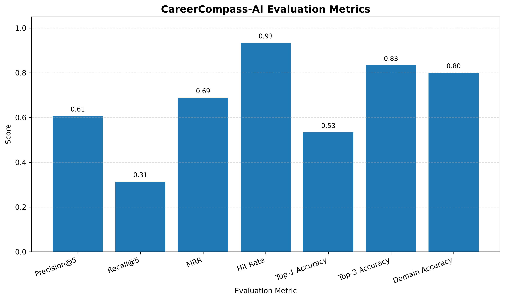
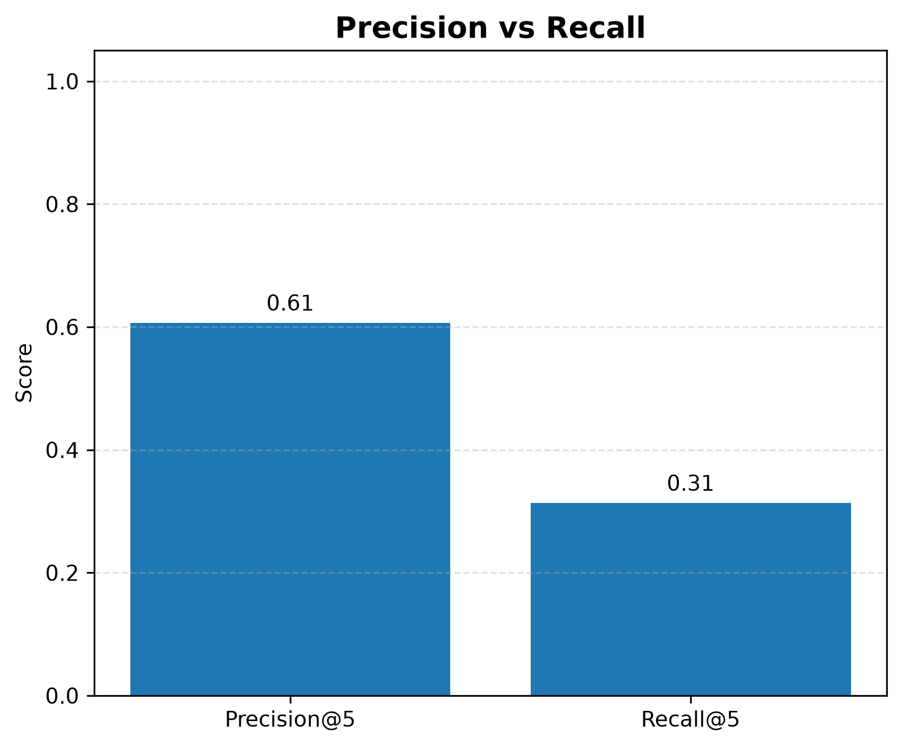
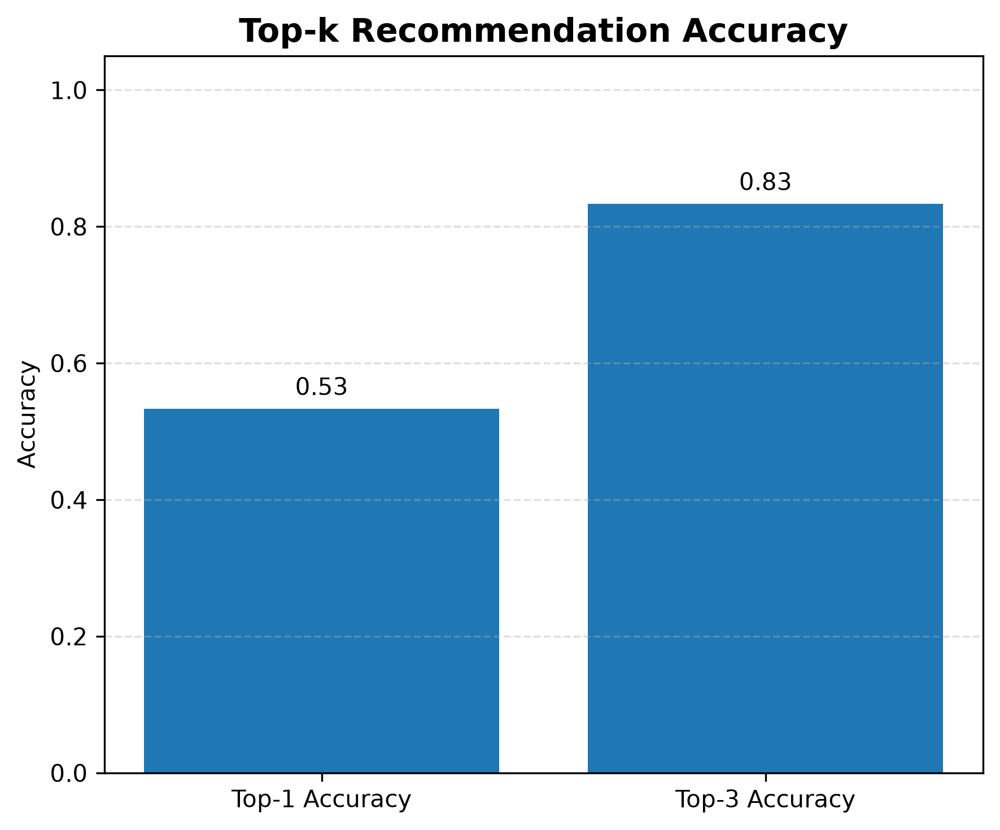
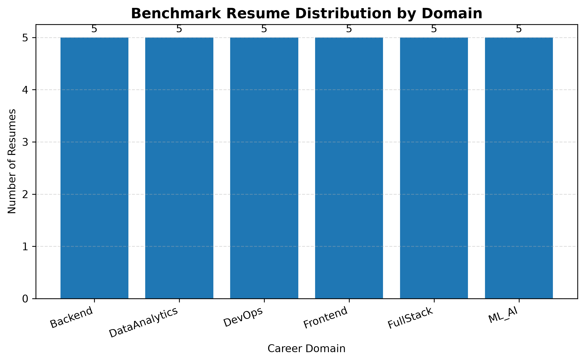
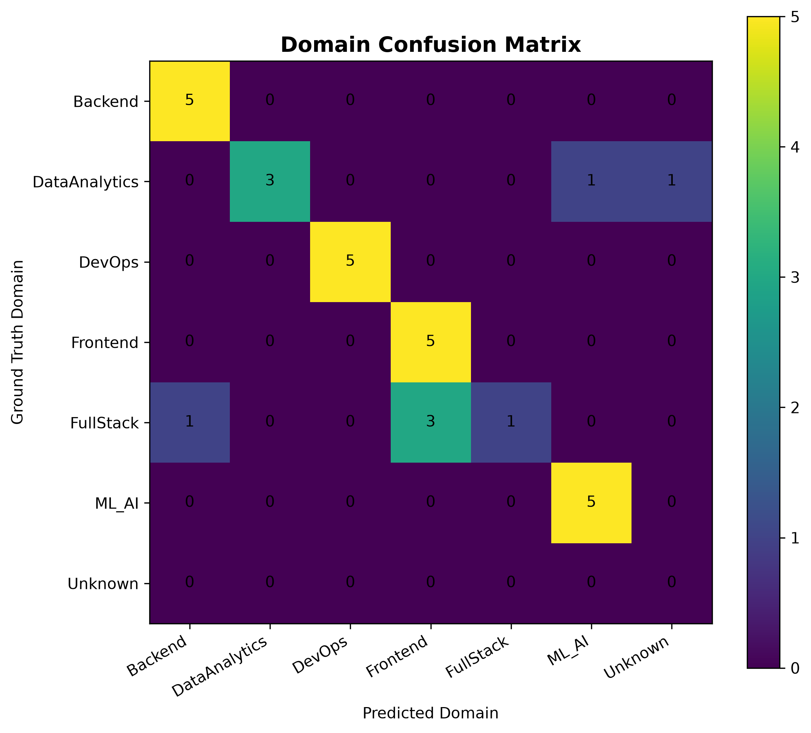

# CareerCompass-AI Evaluation Report

## Overview

This report summarizes the benchmark evaluation of the CareerCompass-AI recommendation engine.

The evaluation pipeline was designed to measure the recommendation quality of the system using a manually curated benchmark dataset consisting of **30 resumes** distributed across multiple software engineering domains.

The benchmark evaluates the recommendation engine using standard Information Retrieval (IR) metrics including Precision@5, Recall@5, Mean Reciprocal Rank (MRR), Hit Rate, Top-k Accuracy, and Domain Accuracy.

All benchmark results, figures, and observations presented in this report were generated automatically by the CareerCompass-AI evaluation pipeline.

---

## Overall Evaluation Metrics

| Metric | Score |
|--------|------:|
| Total Resumes | 30 |
| Precision@5 | 0.607 |
| Recall@5 | 0.313 |
| Mean Reciprocal Rank (MRR) | 0.688 |
| Hit Rate | 0.933 |
| Top-1 Accuracy | 0.533 |
| Top-3 Accuracy | 0.833 |
| Domain Accuracy | 0.800 |

---

## Benchmark Observations

- Recommendation precision is strong and demonstrates relevant job retrieval.
- Recall is moderate, indicating that some relevant jobs are still being missed.
- Ranking quality is good, with relevant jobs generally appearing within the first few recommendations.
- The system successfully recommends at least one relevant job for almost every resume.
- Domain prediction is generally accurate with occasional cross-domain confusion.

---

## Future Improvements

The current benchmark represents **Evaluation Pipeline V1** for CareerCompass-AI.

Planned improvements include:

- Improve semantic retrieval using stronger embedding models.
- Enhance ranking quality through better similarity scoring.
- Introduce advanced evaluation metrics such as MAP@K and nDCG@K.
- Expand the benchmark dataset with additional resume domains and larger sample sizes.
- Improve domain inference to reduce cross-domain prediction errors.
- Perform comparative evaluation against baseline recommendation approaches.
- Conduct ablation studies to measure the contribution of individual system components.

These enhancements will further improve both the recommendation quality and the robustness of the evaluation framework.

---

## Figures

The following visualizations were automatically generated by the evaluation pipeline.

### Metric Bar Chart

### Precision vs Recall

### Top-k Accuracy

### Domain Distribution

### Domain Confusion Matrix

---

